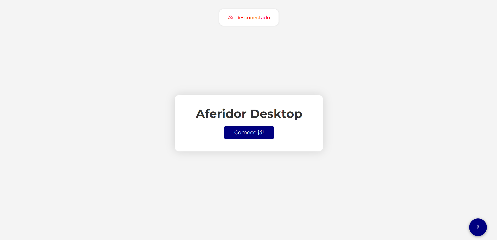
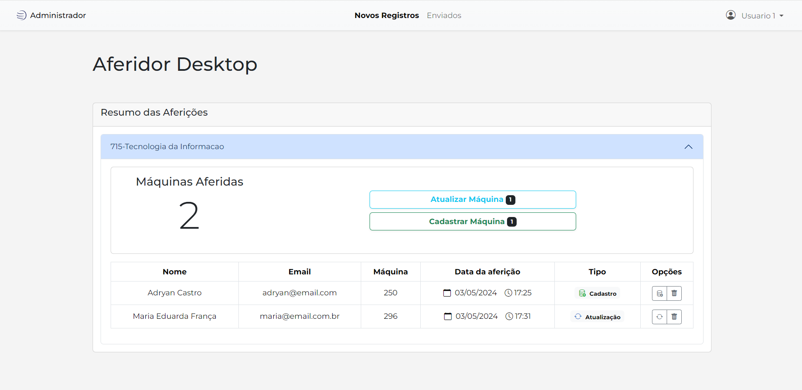

# aferidorDesktop
O **aferidorDesktop** é uma ferramenta desenvolvida para simplificar e otimizar o processo de inventário de máquinas e softwares em ambientes corporativos. Ao substituir o processo manual, que exigia visitas individuais a cada máquina, esta ferramenta permite a obtenção rápida e precisa de dados, com a premissa de que o próprio colaborador ou usuário da máquina possa realizar a coleta e enviá-la para o departamento responsável.

O sistema consiste em um programa Python instalado no computador do usuário e uma interface web que se conecta a esse programa, coordenando todas as etapas, desde a obtenção dos dados até o envio. 

A seguir, há uma visão geral das funcionalidades oferecidas pelo programa, juntamente com uma descrição do processo de aferição facilitado por ele.

## Como funciona o processo de aferição no aferidorDesktop?

Nosso objetivo foi tornar o processo o mais simples e fluido possível, adotando passos rápidos e intuitivos para garantir acessibilidade a todos os públicos, inclusive aqueles com pouca familiaridade com a tecnologia.

.jpeg)

### Resumo do Processo:

1. **Abrir a página principal:**
   - Acesse a página principal do sistema.

2. **Comece já!:**
   - Clique no botão "Comece já!" para iniciar o processo.

3. **Instalação do Programa:**
   - Se você ainda não tem o programa instalado:
     - Clique em "Download" e siga atentamente as instruções.
     - Desative temporariamente o antivírus do seu computador.
     - Execute o instalador como administrador e siga as instruções de instalação.
     - Após a instalação, recarregue a página e volte ao passo 2.

4. **Abrir o Programa:**
   - Após a instalação, abra o programa clicando em "Abrir aferidorDesktop.exe" no site.

5. **Aguardar Conexão:**
   - Aguarde até que seja exibida a confirmação de que você está conectado.

6. **Iniciar o Scan:**
   - Clique no botão "Scan" e aguarde os dados serem exibidos na página.

7. **Revisar e Enviar Dados:**
   - Confira os dados exibidos, preencha o formulário correspondente e envie para o departamento.
   
8. **Conclusão:**
   - Parabéns! A aferição foi concluída com sucesso.

Através dessa sequência simples e direta, desde o acesso à página principal até o envio dos dados ao departamento responsável, é garantido um procedimento fluído e acessível a todos os usuários, não apenas simplificando a aferição, mas também assegurando a precisão e confiabilidade dos resultados obtidos.

## Funcionalidades

>Para saber mais, com imagens e explicações detalhadas, clique sobre o tópico desejado ou acessa a sessão [Visão Geral](https://github.com/adryancf/aferidorDesktop/wiki/Vis%C3%A3o-Geral) da documentação oficial do aferidorDesktop.

  * [**Interface WEB integrada**](https://github.com/adryancf/aferidorDesktop/wiki/Vis%C3%A3o-Geral#detalhando-o-programa): Intuitiva e integrada ao software de obtenção de dados.
  * [**Controle total da aplicação**](https://github.com/adryancf/aferidorDesktop/wiki/Vis%C3%A3o-Geral#controle-total-da-aplica%C3%A7%C3%A3o): Através da interface principal, os usuários têm controle completo sobre todas as etapas do processo, desde a abertura do aplicativo até a obtenção dos dados necessários.
  * [**Visualização instantânea dos dados**](https://github.com/adryancf/aferidorDesktop/wiki/Vis%C3%A3o-Geral#visualiza%C3%A7%C3%A3o-instant%C3%A2nea-dos-dados): Os dados coletados são exibidos instantaneamente na página, oferecendo aos usuários uma visão imediata e atualizada do status do inventário.
  * [**Formulário de envio completo**](https://github.com/adryancf/aferidorDesktop/wiki/Vis%C3%A3o-Geral#formul%C3%A1rio-de-envio-completo): Permite o envio de dados coletados junto com informações relevantes sobre o colaborador associado a máquina.
  * [**Interface de administrador abrangente**](https://github.com/adryancf/aferidorDesktop/wiki/Vis%C3%A3o-Geral#p%C3%A1gina-de-administrador): Reúne todos os dados recebidos, fornecendo uma visão detalhada de todo o processo. Além disso, oferece a capacidade de atualizar ou cadastrar informações sobre o hardware diretamente.
  * [**Comparação com dados anteriores**](https://github.com/adryancf/aferidorDesktop/wiki/Vis%C3%A3o-Geral#compara%C3%A7%C3%A3o-com-dados-anteriores):  Na interface de administrador, é possível realiza a comparação dos dados coletados com registros anteriores da mesma máquina, facilitando a identificação de alterações ou discrepâncias ao longo do tempo.
  
**Com essas funcionalidades, o AferidorDesktop simplifica todo o processo de aferição de hardwares e softwares, aumentando tanto a periodicidade quanto a confiabilidade dos dados obtidos.**

# Demonstração de uso 
Como mencionado anteriormente, o sistema se divide em duas áreas distintas de uso: uma destinada aos usuários comuns e outra voltada para os administradores. Com o intuito de tornar essa distinção mais tangível, foram criados vídeos simulando o uso em ambas as frentes, proporcionando uma demonstração prática do sistema em funcionamento, oferecendo uma visão clara de como ele é utilizado em cenários reais.

## Uso - Colaborador

#### Video Completo - https://youtu.be/LaUF-hVae7A

## Uso - Administrador

#### Video Completo - https://youtu.be/mos7QN9APfk

# Links

[Publicação do Linkedin detalhando o sistema]()

